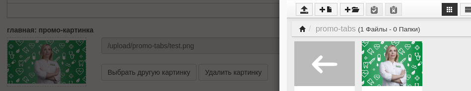

# yii2 ImgSelector Widget for Responsive File Manager 

**`in English below`**

Если вы делали в TinyMCE файловый менеджер - вы могли подключить Responsive File Manager(RFM). После чего задаться вопросом: а почему я с его помощью не могу заполнять инпуты, именами файла, который выбран? Так сказать: "Фото врача" -> "Обзор" -> "Сохранить".

Я сделал такой виджет для себя. По сути потребуется скачать RFM, расположить его в некой папке, в папке `backend/web/` и указать в `backend/config/bootstrap.php` этот путь к нему.

Далее банально: `->widget(\lgxenos\yii2\imgSelector\ImageSelector::className())` на нужном поле в форме админки.

## Установка / Install

`composer require lg-xenos/yii2-img-selector`

**`frontend/config/bootstrap.php`**
```php
Yii::$container->set('lgxenos\yii2\imgSelector\ImageSelector', [
    'fileManagerPathTpl' => '/adm-scripts/responsivefilemanager/filemanager/dialog.php?type=1&field_id=%s&relative_url=0&callback=ImageSelectorCallBack'
]);
```

**`backend/view/test/test.php`**
```php
echo  $form
        ->field($model, 'main_image')
        ->widget(\lgxenos\yii2\imgSelector\ImageSelector::className()); 
```



### About In English

Are you using TinyMCE and one of its plugin Responsive File Manager(RFM)? Maybe you want add some file-browse buttons at yours Admin-Part of site?

I'm just do it. And you at 2 click from that

:)  
